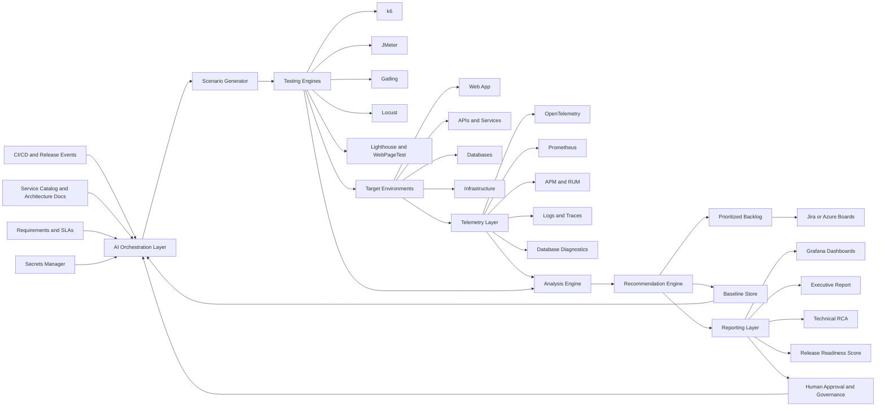

# Performance Testing AI Agent: Research Document and Implementation Blueprint

Date: 2026-05-29  
Audience: Enterprise architects, QA leaders, DevOps engineers, SREs, platform engineers, AI engineers, product owners, release managers

## 1. Executive Summary

The Performance Testing AI Agent is a proactive quality engineering and release-readiness agent that detects performance risks before User Acceptance Testing (UAT), launch, and production rollout. It automates workload discovery, test generation, test execution, telemetry collection, bottleneck analysis, recommendation generation, baseline creation, and release-readiness scoring.

The agent addresses a common enterprise failure pattern: performance testing happens too late, is too manual, and produces reports that are difficult to connect to release decisions. By integrating load testing, Web Vitals, API profiling, database diagnostics, infrastructure telemetry, and AI-assisted analysis into CI/CD and release governance, the agent shifts performance validation left while preserving human approval for high-risk actions.

Recommended implementation approach:

| Area | Recommendation |
| --- | --- |
| Primary load testing engine | k6 for tests-as-code, CI integration, threshold gates, and observability integration |
| Enterprise load alternatives | JMeter for broad protocol/plugin coverage, Gatling for high-scale code-first workloads, Locust for Python-heavy teams |
| Web performance | Lighthouse CI, PageSpeed Insights, WebPageTest, Chrome DevTools protocol, and real-user Core Web Vitals where available |
| Observability | OpenTelemetry instrumentation, Prometheus/Grafana for open-source stacks, Datadog/New Relic/Dynatrace/Elastic for enterprise APM |
| Database diagnostics | pg_stat_statements/pgBadger for PostgreSQL, MySQL Slow Query Log/Performance Schema, SQL Server Query Store/Profiler |
| Agent orchestration | LangGraph or equivalent state-machine workflow for durable execution and human approval checkpoints; OpenAI or other LLM provider for analysis, report synthesis, and structured recommendations |
| Reporting | Grafana dashboards plus AI-generated Markdown/PDF/Power BI-ready executive reports |

Primary outcome: reduce production performance incidents, shorten release validation cycles, improve user experience, and produce a durable pre-launch baseline for regression detection after go-live.

## 2. Agent Purpose and Responsibilities

### Business Problem Solved

Modern applications often fail performance expectations because teams validate performance after feature completion, when fixes are expensive and release timelines are compressed. Manual performance testing also struggles to correlate frontend, API, database, and infrastructure signals. The agent solves this by continuously analyzing performance risk before UAT and production release.

Specific problems addressed:

- Late discovery of latency, throughput, scalability, and stability issues.
- Inconsistent performance test coverage across releases.
- Limited correlation between load test results, Web Vitals, database bottlenecks, and infrastructure saturation.
- Difficulty translating technical performance findings into prioritized business actions.
- Lack of reusable pre-launch baselines for post-launch monitoring and regression analysis.
- Manual effort required to create test scenarios, run tests, interpret results, and produce executive reports.

### Key Objectives

- Validate that applications meet response time, throughput, availability, and scalability targets before UAT.
- Detect bottlenecks across browser, API, service, database, and infrastructure layers.
- Measure Core Web Vitals and user-perceived performance.
- Generate actionable, prioritized performance improvement backlog items.
- Create reproducible performance baselines for future releases.
- Provide release readiness scoring based on objective thresholds and business impact.
- Integrate performance gates into CI/CD while allowing controlled human override.

### Scope

In scope:

- Load, stress, spike, soak/endurance, smoke, breakpoint, and regression performance testing.
- Browser performance and Core Web Vitals assessment.
- API response time, throughput, latency distribution, error rate, and saturation analysis.
- Database query, index, lock, connection pool, wait event, and resource contention analysis.
- Infrastructure and container metrics such as CPU, memory, disk I/O, network, pod/node utilization, autoscaling behavior, and queue depth.
- CI/CD performance gates.
- Recommendation generation and backlog creation.
- Baseline documentation and trend comparison.
- Executive dashboards and technical drill-down reports.

Out of scope for the first release unless explicitly added:

- Production traffic replay against live production systems without formal approval.
- Autonomous infrastructure changes in production.
- Autonomous database schema changes.
- Security penetration testing.
- Full chaos engineering.
- Cost optimization beyond performance-related infrastructure efficiency.

### Autonomous Activities

The agent can perform the following without human intervention once access and guardrails are approved:

- Read architecture metadata, service catalogs, OpenAPI specs, GraphQL schemas, API collections, previous test plans, and monitoring dashboards.
- Generate draft workload models and test scenarios.
- Execute approved tests in non-production environments.
- Run Lighthouse/WebPageTest/PageSpeed-style audits against approved URLs.
- Pull metrics from observability platforms.
- Analyze test results and correlate telemetry across layers.
- Detect trends, regressions, threshold breaches, bottlenecks, and anomalous runs.
- Generate reports, dashboards, release-readiness summaries, and backlog recommendations.
- Store baselines and compare current runs against previous baselines.
- Open non-blocking tickets or draft work items when configured.

### Human Approval or Intervention Required

Human approval should be required for:

- Running tests above agreed traffic limits.
- Executing stress, spike, or destructive breakpoint tests.
- Testing shared environments that could affect other teams.
- Accessing production data, production credentials, or personally identifiable information.
- Changing infrastructure, autoscaling, database indexes, query plans, cache settings, CDN configuration, or production observability rules.
- Overriding performance gates in CI/CD.
- Accepting release-readiness risk when critical issues remain.
- Publishing executive reports externally.
- Creating or modifying Jira/Azure Boards backlog items when workflow policy requires owner approval.

## 3. Inputs

### Application Inputs

| Input | Description | Required | Source |
| --- | --- | --- | --- |
| Application URLs | Public or internal URLs for web flows | Yes for web apps | Environment config, service catalog |
| API endpoints | REST, GraphQL, gRPC, WebSocket, batch, async endpoints | Yes for API apps | OpenAPI, Postman collections, service discovery |
| Environment details | QA, staging, pre-prod, region, deployment version, build SHA | Yes | CI/CD, Kubernetes, CMDB |
| Authentication | Test credentials, OAuth flows, API tokens, service accounts | Yes when protected | Secrets manager |
| Test data | User accounts, product catalogs, order data, synthetic datasets | Yes | Data factory, masked prod snapshot |
| User journeys | Login, search, checkout, quote, submit, dashboard, export, etc. | Yes | Product analytics, BA docs, test cases |
| Business criticality | Revenue impact, customer segment, release priority | Recommended | Product owner, service tier registry |
| Traffic profile | Peak hours, regional distribution, device mix, browser mix | Recommended | Analytics, production logs, CDN logs |

### Performance Requirements

| Requirement | Example |
| --- | --- |
| Concurrent users | 500 normal, 1,500 peak, 5,000 stress |
| Arrival rate | 50 new sessions/minute, 200 requests/second |
| Transactions per second | 100 TPS read, 40 TPS write, 10 TPS checkout |
| Response time SLA | p95 API less than 500 ms, p99 less than 1,500 ms |
| Web Vitals | LCP p75 less than or equal to 2.5 s, INP p75 less than or equal to 200 ms, CLS p75 less than or equal to 0.1 |
| Availability target | 99.9 percent during performance window |
| Error budget | HTTP 5xx below 0.1 percent, business transaction failures below 0.5 percent |
| Throughput target | Sustained 2,000 requests/minute for 60 minutes |
| Endurance target | No memory leak or degradation over 8 to 24 hours |
| Recovery target | System stabilizes within 10 minutes after spike load |

### Technical Inputs

| Input | Description |
| --- | --- |
| Database connection details | Read-only diagnostics account, query stats access, slow log access |
| Monitoring access | APM, metrics, logs, traces, RUM, synthetics |
| Infrastructure metrics | CPU, memory, disk I/O, network, saturation, autoscaling, container restarts |
| CI/CD information | Pipeline IDs, release branch, build artifacts, deploy metadata, environment URL |
| Previous performance reports | Historical baselines, release comparisons, incident reports |
| Architecture metadata | Service dependency graph, database topology, cache/CDN/message queue topology |
| Source control links | Test scripts, scenario definitions, IaC, configuration |
| Feature flags | Enabled/disabled capabilities during test |
| Deployment topology | Kubernetes namespaces, VM scale sets, load balancers, CDN, edge nodes |
| Security policy | Approved test windows, rate limits, data handling, escalation contacts |

## 4. Outputs

### Performance Reports

| Output | Contents |
| --- | --- |
| Load test results | Scenario, VUs/concurrency, arrival rate, p50/p75/p90/p95/p99, throughput, errors, saturation |
| Stress test findings | Breakpoint, saturation point, failure mode, recovery behavior |
| Spike test findings | Response under rapid traffic surge, autoscaling delay, queue buildup, error burst |
| Endurance report | Latency drift, memory growth, connection leaks, GC behavior, resource exhaustion |
| API performance analysis | Endpoint-level latency, throughput, error rate, dependency timing, payload size impact |
| Database bottleneck report | Slow queries, missing indexes, lock waits, scans, temp files, CPU/I/O pressure, connection pool exhaustion |
| Core Web Vitals assessment | LCP, INP, CLS, FCP, TTFB, device/browser/network conditions, lab and field comparisons |
| Infrastructure utilization report | CPU, memory, disk, network, node/pod capacity, autoscaling behavior, headroom |

### Optimization Deliverables

| Output | Contents |
| --- | --- |
| Prioritized backlog | Ranked issues with severity, business impact, owner, estimated effort, expected gain |
| Root cause analysis | Correlated evidence across test data, metrics, traces, logs, DB stats, code references |
| Recommendations | Query optimization, indexing, caching, pagination, async processing, CDN, frontend improvements |
| Risk assessment | Release blockers, high-risk issues, accepted risks, mitigation plan |
| Experiment plan | A/B or canary validation for recommended changes |
| Regression guardrails | Thresholds to add to CI/CD and monitoring |

### Baseline Documentation

| Output | Contents |
| --- | --- |
| Pre-launch benchmark | Stable baseline by scenario, endpoint, page, service, and infrastructure layer |
| Capacity plan | Current capacity, peak safe load, scaling forecast, headroom, cost tradeoffs |
| Performance scorecard | SLA compliance, Web Vitals status, database health, infrastructure health, risk score |
| Post-launch comparison baseline | Metrics and thresholds for production monitoring and regression alerts |
| Runbook appendices | How to reproduce tests, required data, scripts, dashboards, owners |

### Executive Dashboards

Dashboards should include:

- Release readiness score.
- SLA compliance status by service and journey.
- Core Web Vitals status by page type.
- Trend of p95/p99 latency across releases.
- Error rate and availability trend.
- Capacity headroom and saturation risk.
- Top 10 bottlenecks by business impact.
- Open performance backlog by severity and owner.
- Baseline versus current release comparison.

## 5. Success Criteria

### Performance Validation KPIs

| KPI | Target Example |
| --- | --- |
| API p95 latency | Meets endpoint-specific SLA, for example p95 less than 500 ms |
| API p99 latency | Meets resilience target, for example p99 less than 1,500 ms |
| Error rate | Less than 0.1 percent HTTP 5xx, less than 0.5 percent business errors |
| Throughput | Sustains target TPS for required duration |
| Availability during test | Greater than or equal to 99.9 percent for planned window |
| Core Web Vitals | LCP p75 less than or equal to 2.5 s, INP p75 less than or equal to 200 ms, CLS p75 less than or equal to 0.1 |
| FCP | Meets internal target, typically less than or equal to 1.8 s for good user perception |
| TTFB | Meets internal target, typically less than or equal to 800 ms |
| Database bottlenecks | No critical slow queries, blocking locks, or missing indexes on critical paths |
| Infrastructure saturation | Sustained CPU, memory, disk, and network remain below agreed saturation thresholds |
| Endurance stability | No statistically significant latency drift or resource leak |

### Agent Effectiveness KPIs

| KPI | Target Example |
| --- | --- |
| Pre-UAT issue detection | Detect at least 80 percent of performance defects before UAT |
| Production incident reduction | Reduce Sev1/Sev2 performance incidents by 30 to 50 percent within 2 to 3 release cycles |
| Root cause accuracy | At least 85 percent of agent RCAs accepted by engineering review |
| Recommendation usefulness | At least 70 percent of high-priority recommendations accepted or implemented |
| Manual testing effort reduction | Reduce repetitive performance analysis/reporting effort by 40 to 60 percent |
| Baseline coverage | 100 percent of Tier 1 journeys have release baselines |
| CI/CD gate precision | Less than 10 percent false-positive release blocks after calibration |
| Time to report | Draft technical and executive report within 30 minutes of test completion |

### Business Outcome KPIs

| KPI | Target Example |
| --- | --- |
| Release cycle speed | Reduce performance validation lead time by 25 to 40 percent |
| User experience | Improve Core Web Vitals pass rate and reduce slow-page sessions |
| Reliability | Lower performance-related support tickets and incident escalations |
| Infrastructure efficiency | Identify over-provisioned or inefficient components and reduce avoidable spend |
| Conversion and engagement | Improve checkout, signup, search, or transaction completion rates where latency-sensitive |
| Governance | Every launch has objective performance evidence and approved risk disposition |

## 6. Tools and Technology Stack

### Recommended Reference Stack

| Layer | Preferred Tools | Rationale |
| --- | --- | --- |
| Agent orchestration | LangGraph, OpenAI tools/function calling, structured outputs | Durable workflow, explicit approval checkpoints, schema-controlled outputs |
| Test authoring | k6, JMeter, Gatling, Locust | Covers JavaScript, GUI/legacy, JVM high-scale, and Python ecosystems |
| Browser performance | Lighthouse CI, Chrome DevTools Protocol, WebPageTest, PageSpeed Insights | Lab and field-style web performance assessment |
| API performance | k6, JMeter, Postman, Grafana k6 Cloud | Scripted tests, collections, cloud scale, thresholds |
| Observability | OpenTelemetry, Prometheus, Grafana, Datadog, New Relic, Dynatrace, Elastic | Metrics, logs, traces, APM, RUM, dashboards |
| Database analysis | pg_stat_statements, pgBadger, MySQL Slow Query Log, Performance Schema, SQL Server Query Store, Explain Plans | Database-native bottleneck analysis |
| Data storage | PostgreSQL, object storage, time-series database, artifact repository | Baseline and report retention |
| CI/CD | Jenkins, GitHub Actions, GitLab CI/CD, Azure DevOps | Release integration and gates |
| Reporting | Grafana, Power BI, Markdown/PDF, Confluence/SharePoint | Technical and executive consumption |
| Work management | Jira, Azure Boards, GitHub Issues, ServiceNow | Actionable backlog creation |
| Secrets | HashiCorp Vault, AWS Secrets Manager, Azure Key Vault, GCP Secret Manager | Credential control and auditability |

### Load Testing Tool Comparison

| Tool | Strengths | Best Fit | Considerations |
| --- | --- | --- | --- |
| k6 | Developer-friendly JavaScript tests-as-code, thresholds, CI/CD integration, cloud option, browser module | Modern API and service performance testing | Smaller plugin ecosystem than JMeter |
| JMeter | Mature, broad protocol support, GUI, plugins, HTML reporting, distributed mode | Enterprise legacy apps, mixed protocols, teams with existing JMX assets | Test plans can become hard to maintain at scale |
| Gatling | High-performance asynchronous engine, code-first SDKs, strong reports, Enterprise dashboards | High-scale JVM/JS/TS performance engineering | Requires code comfort; enterprise features commercial |
| Locust | Python user behavior modeling, flexible custom logic, distributed workers | Python-centric teams, custom user journeys | Requires disciplined engineering practices for large suites |

Recommended default: use k6 for new API/service performance tests because it is code-native, threshold-friendly, and CI-friendly. Use JMeter for protocol breadth or existing test-plan reuse. Use Gatling where very high-scale code-first simulations are needed. Use Locust when user behavior is easiest to express in Python.

### Web Performance Tooling

| Tool | Use |
| --- | --- |
| Lighthouse CI | Automated lab audits in CI with budget enforcement |
| PageSpeed Insights | Field/lab web performance assessment using Google tooling |
| WebPageTest | Deep browser waterfall, filmstrip, device/network tests, repeat-view tests |
| Chrome DevTools | Local profiling, performance traces, CPU/network throttling, layout shift debugging |
| RUM/APM | Production-like field measurements and post-launch monitoring |

Core Web Vitals thresholds to use:

| Metric | Good | Poor | Recommended Percentile |
| --- | --- | --- | --- |
| LCP | Less than or equal to 2.5 seconds | Greater than 4.0 seconds | p75 |
| INP | Less than or equal to 200 ms | Greater than 500 ms | p75 |
| CLS | Less than or equal to 0.1 | Greater than 0.25 | p75 |

Additional useful thresholds:

| Metric | Good Target |
| --- | --- |
| FCP | Less than or equal to 1.8 seconds |
| TTFB | Less than or equal to 800 ms |

### API Performance Tooling

Recommended agent metrics:

- Response time percentiles: p50, p75, p90, p95, p99.
- Request rate and throughput.
- Concurrency and arrival rate.
- Error rate by status code and business assertion.
- Retry rate and timeout rate.
- Payload size and serialization cost.
- Dependency call timing from traces.
- Saturation metrics from service runtime and infrastructure.

### Database Analysis Tooling

| Database | Tools | Findings |
| --- | --- | --- |
| PostgreSQL | pg_stat_statements, auto_explain, EXPLAIN ANALYZE, pgBadger, lock/wait views | Top total-time queries, slow individual queries, scan issues, lock waits, temp files |
| MySQL | Slow Query Log, mysqldumpslow, Performance Schema, EXPLAIN, optimizer trace | Slow queries, lock time, rows examined, missing indexes, wait events |
| SQL Server | Query Store, SQL Server Profiler/Extended Events, execution plans, DMVs | Regressed plans, high CPU/IO queries, blocking, waits, plan forcing candidates |
| Oracle | AWR, ASH, SQL Monitor, Explain Plan | Wait classes, SQL tuning, contention, capacity |
| NoSQL | Native profiler/slow logs, index stats, explain plans, partition metrics | Hot partitions, inefficient scans, high RU/throughput usage, index gaps |

### Monitoring and Observability

The agent should use OpenTelemetry where possible for vendor-neutral instrumentation. It should collect:

- Metrics: latency, throughput, error rate, CPU, memory, I/O, network, queue depth.
- Traces: request path, dependency timing, database spans, cache spans, downstream calls.
- Logs: structured error events, slow operations, GC logs, timeout events.
- Profiles where available: CPU, heap, allocation, lock contention.
- RUM: browser timing, Core Web Vitals, route-level frontend performance.

### AI and Automation Layer

Recommended capabilities:

- Structured output schemas for findings, recommendations, risks, and backlog items.
- Tool calling for test execution, metrics retrieval, dashboard publishing, ticket drafting, and report generation.
- Durable workflows for long-running tests and approval checkpoints.
- Human-in-the-loop controls for stress tests, high-cost tests, and remediation actions.
- Retrieval over previous reports, runbooks, architecture docs, and incident history.
- Evaluation suite for RCA accuracy, recommendation quality, and false-positive gate behavior.

### CI/CD Integration

CI/CD usage patterns:

- Pull request smoke performance test for critical endpoints.
- Nightly scheduled load regression suite.
- Pre-UAT full load, spike, and endurance suite.
- Release candidate gate with baseline comparison.
- Post-deploy synthetic and RUM comparison.
- Manual approval gate when risks exceed release threshold.

Example gate rules:

- Fail pipeline if p95 latency exceeds SLA by more than 10 percent for Tier 1 journey.
- Fail pipeline if HTTP 5xx exceeds 0.1 percent under target load.
- Warn if LCP worsens by more than 15 percent but remains within threshold.
- Block release if database lock waits or CPU saturation are critical during required load.
- Require human approval if stress tests indicate failure below forecast peak plus safety margin.

## 7. Prerequisites

### Environment Setup

- Stable QA/staging/pre-prod environment that resembles production topology.
- Test environment isolated enough to avoid disrupting shared teams.
- Monitoring agents installed and validated.
- Application logs structured and queryable.
- Database diagnostics enabled with approved retention.
- Synthetic test data prepared and refreshed.
- Dedicated test user accounts and roles.
- Network access from load generators to target systems.
- DNS, CDN, WAF, rate limits, and firewall rules configured for approved tests.
- Time synchronization across systems for correlation.

### Performance Governance

- SLAs/SLOs defined for each Tier 1 user journey and API.
- Workload model approved by product, architecture, and operations.
- Acceptance criteria approved before test execution.
- Test windows and escalation contacts documented.
- Release risk rubric defined.
- Thresholds version-controlled.
- Baseline retention policy defined.
- Approval process defined for stress tests and production-impacting actions.

### Infrastructure Requirements

- Load generator infrastructure sized for expected concurrency and traffic.
- Ability to run distributed generators for high-scale and multi-region tests.
- Metrics, logs, traces, and test-result storage.
- Dashboard platform.
- Artifact repository for reports.
- Secrets manager.
- Queue or workflow engine for agent jobs.
- Durable state store for agent workflow progress.
- Alerting and notification channels.

### Security and Compliance

- Least-privilege access controls.
- No production credentials in test scripts.
- All secrets stored in a secrets manager.
- Data masking or synthetic data for PII/PHI/payment data.
- Audit logs for test execution and agent decisions.
- Approved retention for telemetry and reports.
- Compliance review for regulated environments.
- Prompt and report redaction rules to prevent sensitive data leakage.
- Human approval for actions that can change customer-facing behavior or infrastructure cost.

## 8. End-to-End AI Agent Workflow

### Workflow Summary

1. Discover application architecture.
2. Collect performance requirements.
3. Generate workload model and test scenarios.
4. Validate prerequisites and approvals.
5. Execute load, stress, spike, and endurance tests.
6. Collect frontend, API, database, and infrastructure metrics.
7. Correlate findings across layers.
8. Identify bottlenecks and root causes.
9. Prioritize issues by business impact.
10. Generate optimization recommendations.
11. Create performance baseline documentation.
12. Publish dashboards and reports.
13. Provide release readiness assessment.
14. Feed accepted learnings back into baselines, test suites, and runbooks.

### Detailed Workflow

| Step | Agent Activity | Human Role | Output |
| --- | --- | --- | --- |
| 1. Intake | Reads release metadata, app URLs, APIs, architecture docs, previous reports | Provide missing context | Intake summary |
| 2. Requirement mapping | Extracts SLAs, SLOs, traffic targets, critical journeys | Approve targets | Performance requirement matrix |
| 3. Workload modeling | Builds user mix, arrival rates, ramp profiles, test duration | Validate realism | Workload model |
| 4. Scenario generation | Creates k6/JMeter/Gatling/Locust tests from APIs and journeys | Review high-risk scripts | Test scripts |
| 5. Preflight | Validates credentials, monitoring, environment health, data readiness | Approve test window | Readiness checklist |
| 6. Smoke performance test | Executes low-load validation | Monitor for environment issues | Smoke report |
| 7. Load test | Executes expected and peak load | Approve if shared environment | Load results |
| 8. Stress/spike/endurance | Executes approved advanced tests | Required approval | Capacity and stability findings |
| 9. Telemetry correlation | Pulls metrics, traces, logs, DB stats | Support access issues | Correlation graph |
| 10. RCA | Infers root causes with evidence and confidence | Validate findings | RCA report |
| 11. Prioritization | Ranks issues by severity, business impact, UX impact, effort | Confirm owners | Backlog |
| 12. Recommendations | Generates optimization guidance and validation plan | Approve remediation | Recommendation set |
| 13. Baseline | Stores benchmark metrics and artifacts | Approve baseline | Baseline package |
| 14. Release readiness | Scores release and generates executive summary | Accept or block release | Readiness decision |

### Test Types

| Test Type | Purpose | Typical Trigger |
| --- | --- | --- |
| Smoke performance | Validate scripts, data, credentials, and telemetry | Every PR or deployment |
| Load test | Validate normal and peak expected traffic | Pre-UAT, nightly, release candidate |
| Stress test | Find saturation and failure mode | Pre-launch approval window |
| Spike test | Validate sudden traffic increase and recovery | Campaigns, launches, seasonal events |
| Endurance/soak | Detect leaks and degradation over time | Major release, platform changes |
| Regression test | Compare against baseline | Every release candidate |
| Capacity test | Estimate safe load and headroom | Quarterly or before major growth |

## 9. System Architecture

### Architecture Components

#### AI Orchestration Layer

Responsibilities:

- Maintains workflow state.
- Invokes tools through controlled APIs.
- Enforces approval gates.
- Stores execution history.
- Routes work across specialized sub-agents.
- Produces structured findings and recommendations.

Recommended design:

- Use a graph/state-machine workflow for deterministic stages.
- Store workflow state in PostgreSQL or another durable store.
- Add human approval nodes before high-risk tests and remediation actions.
- Validate all LLM outputs against schemas.
- Log every agent action for audit.

#### Testing Engines

Responsibilities:

- Execute synthetic user journeys and API calls.
- Generate load according to approved profiles.
- Measure request metrics and browser metrics.
- Export results to time-series and artifact stores.

Design guidance:

- Keep test scripts version-controlled.
- Parameterize environment, credentials, test data, and thresholds.
- Use distributed execution for large tests.
- Add guardrails to prevent accidental production overload.

#### Monitoring and Telemetry Layer

Responsibilities:

- Collect metrics, traces, logs, RUM, infrastructure metrics, and DB diagnostics.
- Correlate test run IDs across all telemetry.
- Provide raw evidence for RCA.

Design guidance:

- Inject a unique `performance_test_run_id` into headers, logs, traces, and metrics.
- Use OpenTelemetry conventions where possible.
- Align timestamps across systems.
- Retain high-resolution metrics during test windows.

#### Analysis Engine

Responsibilities:

- Compute performance statistics.
- Compare current results against SLA and baselines.
- Detect anomalies and regressions.
- Correlate frontend, API, DB, and infrastructure symptoms.
- Rank confidence of suspected root causes.

Recommended analysis methods:

- Threshold evaluation.
- Baseline comparison.
- Time-series anomaly detection.
- Trace critical-path analysis.
- Query fingerprint aggregation.
- Saturation and utilization analysis.
- Queueing and dependency timing analysis.

#### Recommendation Engine

Responsibilities:

- Convert findings into actionable optimizations.
- Estimate impact, effort, risk, and validation method.
- Create backlog-ready work items.

Recommendation examples:

- Add or adjust database indexes based on query plan and workload evidence.
- Reduce N+1 database calls.
- Add caching for repeated read-heavy endpoints.
- Tune connection pools and thread pools.
- Split slow synchronous workflows into asynchronous processing.
- Optimize LCP images, render-blocking resources, and JavaScript execution.
- Add CDN caching or edge optimization.
- Increase autoscaling minimums or tune scaling signals.

#### Reporting Layer

Responsibilities:

- Produce role-specific reports.
- Publish dashboards.
- Generate release readiness score.
- Preserve baseline artifacts.

Report consumers:

- Executives: readiness, risks, business impact, decision.
- QA leaders: test coverage, pass/fail, defect trends.
- DevOps/SRE: saturation, telemetry, capacity, alerting.
- Architects: bottlenecks, systemic risks, architecture recommendations.
- Developers: endpoint/page/query-specific fixes.

#### CI/CD Integration

Responsibilities:

- Trigger tests at appropriate release stages.
- Fail or warn pipeline based on thresholds.
- Attach reports to build artifacts.
- Create annotations and tickets.
- Require approvals for release overrides.

#### Feedback Loop for Continuous Learning

Responsibilities:

- Store outcomes of recommendations.
- Track whether issues were accepted, rejected, or fixed.
- Compare post-fix metrics to expected improvement.
- Improve ranking, thresholds, and workload models over time.
- Incorporate production incidents into future test scenarios.

## 10. Risk Assessment

| Risk | Impact | Mitigation |
| --- | --- | --- |
| Overloading shared environments | Disrupts QA/UAT or dependent teams | Approved test windows, load caps, preflight checks, kill switch |
| False positive release blocks | Slows release pipeline | Baseline calibration, confidence scoring, trend-based gates, manual override |
| False negative findings | Production incident slips through | Coverage reviews, production telemetry feedback, scenario expansion |
| Poor test data realism | Misleading results | Synthetic data factory, masked production-like data, analytics-derived mix |
| Credential leakage | Security incident | Secrets manager, redaction, least privilege, audit logs |
| LLM hallucinated RCA | Incorrect remediation | Evidence-backed output schema, confidence scoring, human review |
| Tool sprawl | Operational overhead | Standard reference stack and approved exception path |
| High load-generation cost | Budget overrun | Tiered testing strategy, local smoke tests, scheduled cloud scale tests |
| Database diagnostic overhead | Performance distortion | Read-only diagnostics, controlled sampling, DBA-approved settings |
| Unclear ownership | Findings do not get fixed | Backlog integration, owner mapping, release governance |
| Compliance violation | Regulatory exposure | Data masking, retention policy, approval workflow, audit trail |
| Model/provider outage | Agent unavailable | Retry, fallback model/provider, manual test execution runbooks |

## 11. Implementation Roadmap

### Phase 0: Strategy and Governance, 2 to 3 Weeks

Objectives:

- Define agent scope and success metrics.
- Select pilot application.
- Approve access, security, and test governance.
- Define release-readiness rubric.

Deliverables:

- Pilot charter.
- Tool selection decision.
- SLA/SLO matrix.
- Test environment readiness checklist.
- Approval workflow.

### Phase 1: Foundation MVP, 4 to 6 Weeks

Objectives:

- Implement orchestration skeleton.
- Integrate one load testing engine, recommended k6.
- Integrate one observability stack.
- Generate first AI-assisted report.

Deliverables:

- Agent workflow service.
- Scenario schema.
- k6 smoke/load test templates.
- Metrics ingestion pipeline.
- Baseline data model.
- Draft technical report.

Success target:

- Agent runs one approved load test, retrieves metrics, generates a report, and stores a baseline for one Tier 1 journey.

### Phase 2: Full Performance Coverage, 6 to 8 Weeks

Objectives:

- Add Web Vitals, API, database, and infrastructure correlation.
- Add stress, spike, and endurance workflows.
- Add release readiness scoring.
- Add dashboard publishing.

Deliverables:

- Lighthouse/WebPageTest integration.
- Database diagnostics connector.
- Grafana dashboard templates.
- RCA and recommendation schemas.
- Backlog generation integration.
- Release gate policy.

Success target:

- Agent produces reliable release-readiness assessment for all Tier 1 journeys in the pilot application.

### Phase 3: Enterprise Integration, 8 to 12 Weeks

Objectives:

- Expand across applications and teams.
- Integrate CI/CD gates.
- Add multi-region/distributed load generation.
- Add work management integration.
- Harden security and audit controls.

Deliverables:

- CI/CD reusable templates.
- Multi-app onboarding guide.
- Role-based access model.
- Historical trend dashboards.
- Jira/Azure Boards integration.
- Executive Power BI/Grafana dashboards.

Success target:

- Agent is used in release governance for multiple applications and creates accepted performance backlogs.

### Phase 4: Optimization and Continuous Learning, Ongoing

Objectives:

- Improve recommendation quality.
- Add incident feedback loop.
- Add cost and capacity forecasting.
- Expand autonomous analysis coverage.

Deliverables:

- Recommendation outcome tracker.
- Model evaluation suite.
- Capacity forecast model.
- Post-launch regression detection.
- Cross-release performance intelligence.

## 12. Future Enhancements

- Production-safe traffic shadowing or replay with strict controls.
- Automated canary analysis for performance regressions.
- Predictive capacity forecasting using seasonality and business growth data.
- Cost-performance optimization recommendations.
- Automatic generation of synthetic monitoring scripts from real user journeys.
- AI-assisted flamegraph and profile interpretation.
- Database index recommendation simulation with estimated write overhead.
- Service dependency graph enrichment from traces.
- Multi-cloud and hybrid test execution.
- Agent-to-agent collaboration with security, reliability, accessibility, and test automation agents.
- Self-healing runbook suggestions, gated by human approval.
- Natural-language query interface for performance history.
- Performance knowledge graph across releases, services, incidents, and fixes.

## 13. Estimated ROI and Business Value

### Value Drivers

| Value Driver | Business Value |
| --- | --- |
| Earlier defect discovery | Reduces expensive late-cycle fixes and release delays |
| Automated reporting | Saves QA/SRE effort and improves consistency |
| Release readiness scoring | Improves executive decision quality |
| Baseline creation | Enables post-launch regression detection |
| Reduced incidents | Avoids revenue loss, support costs, and reputational damage |
| Better user experience | Improves conversion, engagement, retention, and satisfaction |
| Capacity planning | Prevents over-provisioning and under-provisioning |
| CI/CD gates | Prevents known regressions from reaching UAT or production |

### Illustrative ROI Model

Assumptions for a mid-sized enterprise pilot:

| Metric | Baseline | With Agent | Estimated Impact |
| --- | --- | --- | --- |
| Manual performance analysis/reporting | 80 hours/release | 30 hours/release | 50 hours saved |
| Late performance defects | 8/release | 4/release | 50 percent reduction |
| Production performance incidents | 6/year | 3/year | 50 percent reduction |
| Average incident cost | $50,000 | $50,000 | $150,000 annual avoided cost |
| Release delay due to performance | 3 days/release | 1 day/release | 2 days saved |
| Infrastructure inefficiency | Unknown | Identified and optimized | 5 to 15 percent savings candidate |

ROI should be measured using actual organization data after the pilot. The agent should track accepted recommendations, implemented fixes, prevented incidents, release delay reduction, and infrastructure savings to support a defensible business case.

## 14. Prioritized Performance Backlog Scoring Model

The agent should score each finding with a transparent weighted model:

| Factor | Weight | Scoring Guidance |
| --- | --- | --- |
| Business impact | 30 percent | Revenue, user volume, customer segment, release criticality |
| User experience impact | 25 percent | Web Vitals, journey latency, failed transactions |
| Technical severity | 25 percent | SLA breach size, saturation, bottleneck criticality |
| Frequency/coverage | 10 percent | How often the issue occurs and how many users/endpoints affected |
| Fix confidence | 5 percent | Strength of evidence and RCA confidence |
| Implementation effort | 5 percent inverse | Lower effort receives higher urgency when impact is comparable |

Backlog priority bands:

| Band | Score | Action |
| --- | --- | --- |
| P0 Release Blocker | 90 to 100 | Must fix or formally accept risk before release |
| P1 High | 75 to 89 | Fix before UAT or next release candidate |
| P2 Medium | 50 to 74 | Add to sprint backlog with validation plan |
| P3 Low | 25 to 49 | Track and reassess |
| Informational | 0 to 24 | No immediate action |

## 15. Release Readiness Scorecard

| Dimension | Weight | Example Passing Criteria |
| --- | --- | --- |
| Critical journey SLA compliance | 25 percent | All Tier 1 p95/p99 targets pass |
| Error rate and availability | 15 percent | Error and availability targets pass |
| Core Web Vitals | 15 percent | LCP, INP, CLS pass for key pages |
| Database health | 15 percent | No critical slow queries, locks, or missing indexes |
| Infrastructure headroom | 10 percent | No sustained saturation and scaling works |
| Endurance stability | 10 percent | No leak or degradation during soak |
| Regression against baseline | 10 percent | No material degradation from previous approved baseline |

Readiness levels:

| Score | Status | Meaning |
| --- | --- | --- |
| 90 to 100 | Green | Ready for release from performance standpoint |
| 75 to 89 | Amber | Proceed only with mitigations and owner approval |
| 60 to 74 | Red | Not recommended for release without remediation |
| Less than 60 | Blocked | Critical performance risk |

## 16. Implementation Blueprint

### Core Data Model

Recommended entities:

- Application.
- Environment.
- Release.
- User journey.
- Endpoint.
- Scenario.
- Workload model.
- Test run.
- Metric series.
- Threshold.
- Baseline.
- Finding.
- Root cause.
- Recommendation.
- Backlog item.
- Approval.
- Report.

### Agent Roles

| Role | Responsibility |
| --- | --- |
| Orchestrator Agent | Controls workflow, gates, state, and tool calls |
| Scenario Agent | Converts requirements and APIs into test scripts |
| Execution Agent | Runs tests and manages load generators |
| Telemetry Agent | Pulls metrics, logs, traces, RUM, and DB stats |
| Analysis Agent | Computes pass/fail, regressions, anomalies, and correlations |
| RCA Agent | Produces evidence-backed root cause hypotheses |
| Recommendation Agent | Creates remediation and validation plans |
| Reporting Agent | Generates technical and executive outputs |
| Governance Agent | Enforces approvals, risk policies, and audit logging |

### Minimal Viable Workflow API

The MVP should expose:

- `POST /runs` to start an approved performance run.
- `GET /runs/{id}` to retrieve status and evidence.
- `POST /runs/{id}/approve` for human approval gates.
- `GET /runs/{id}/report` for generated report.
- `GET /baselines/{application}/{environment}` for baseline comparison.
- `POST /findings/{id}/backlog` to create a work item.

### Guardrails

- Require run ID propagation to all tests and headers.
- Enforce environment allowlist.
- Enforce max concurrency and duration by environment.
- Require manual approval for stress/spike/endurance tests.
- Validate all test scripts before execution.
- Validate all LLM outputs with JSON schemas.
- Require evidence links for every critical finding.
- Store immutable audit trail of agent decisions.
- Redact secrets, tokens, and PII from prompts and reports.

## 17. Recommended Pilot

Select one high-value, moderately complex application:

- Has known critical user journeys.
- Has APIs and database dependencies.
- Has staging/pre-prod environment.
- Has observability access.
- Has previous performance issues or business sensitivity.
- Has engaged QA, DevOps, and product owners.

Pilot success criteria:

- At least three Tier 1 journeys covered.
- At least one load, spike, and endurance test executed.
- Baseline stored and dashboard published.
- At least five actionable findings generated.
- At least 80 percent of high-severity findings accepted by engineers.
- Release readiness score reviewed by release governance.

## 18. References

- Google web.dev, "How the Core Web Vitals metrics thresholds were defined": https://web.dev/defining-core-web-vitals-thresholds/
- Google web.dev, "Optimize Largest Contentful Paint": https://web.dev/articles/optimize-lcp
- Apache JMeter User Manual: https://jmeter.apache.org/usermanual/
- Grafana k6 documentation: https://grafana.com/docs/k6/latest/
- Grafana Cloud k6 documentation: https://grafana.com/docs/grafana-cloud/testing/k6/
- Gatling documentation: https://docs.gatling.io/
- Locust documentation: https://docs.locust.io/
- Postman API performance testing documentation: https://learning.postman.com/docs/tests-and-scripts/test-apis/performance-testing/
- Prometheus overview: https://prometheus.io/docs/introduction/overview/
- Grafana dashboards documentation: https://grafana.com/docs/grafana/latest/visualizations/dashboards/
- Grafana alerting documentation: https://grafana.com/docs/grafana/latest/alerting/
- OpenTelemetry documentation: https://opentelemetry.io/docs/
- PostgreSQL pg_stat_statements documentation: https://www.postgresql.org/docs/current/pgstatstatements.html
- MySQL Slow Query Log documentation: https://dev.mysql.com/doc/refman/8.0/en/slow-query-log.html
- Microsoft SQL Server Query Store documentation: https://learn.microsoft.com/en-us/sql/relational-databases/performance/tune-performance-with-the-query-store
- Jenkins Pipeline documentation: https://www.jenkins.io/doc/book/pipeline/
- GitHub Actions documentation: https://docs.github.com/en/actions
- GitLab CI/CD pipeline documentation: https://docs.gitlab.com/ci/pipelines/
- Azure Pipelines documentation: https://learn.microsoft.com/en-us/azure/devops/pipelines/
- OpenAI structured outputs documentation: https://platform.openai.com/docs/guides/structured-outputs
- LangGraph documentation: https://docs.langchain.com/oss/python/langgraph/overview
- CrewAI documentation: https://docs.crewai.com/
- Microsoft Agent Framework overview: https://learn.microsoft.com/agent-framework/
